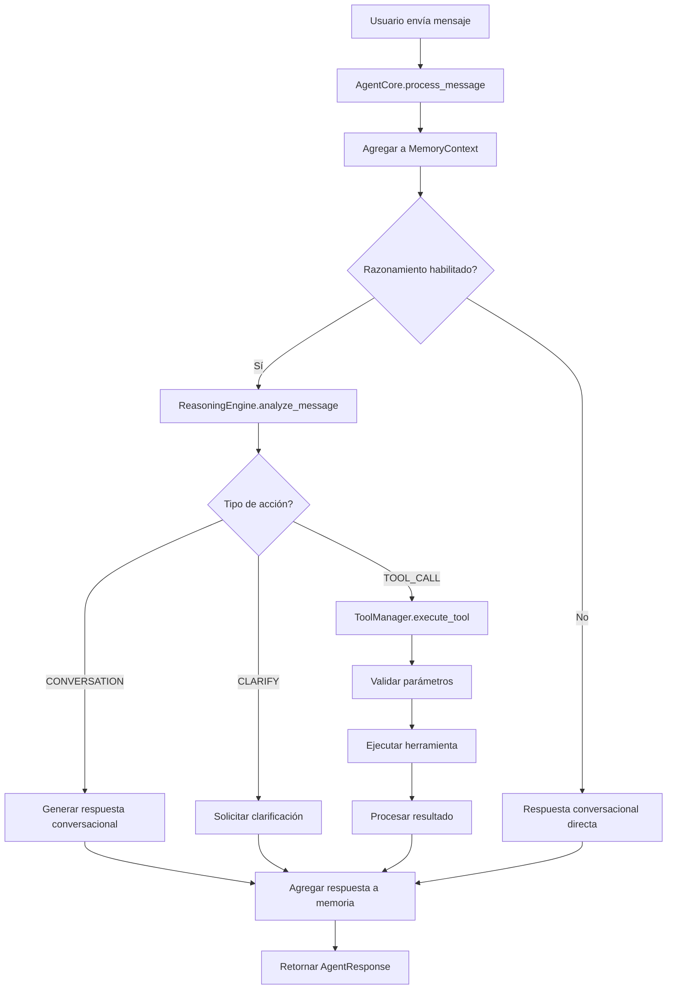

# MCP Agent - Documentación Técnica Completa

## 📋 Tabla de Contenidos

1. [Visión General](#visión-general)
2. [Arquitectura del Sistema](#arquitectura-del-sistema)
3. [Componentes Principales](#componentes-principales)
4. [APIs y Interfaces](#apis-y-interfaces)
5. [Flujos de Procesamiento](#flujos-de-procesamiento)
6. [Configuración y Despliegue](#configuración-y-despliegue)
7. [Ejemplos de Uso](#ejemplos-de-uso)
8. [Mejores Prácticas](#mejores-prácticas)
9. [Troubleshooting](#troubleshooting)

---

## 🎯 Visión General

El **MCP Agent** (Model Context Protocol Agent) es un sistema de agente conversacional autónomo diseñado con arquitectura modular y capacidades avanzadas de razonamiento. Implementa el protocolo MCP para la orquestación de herramientas, gestión de memoria contextual y procesamiento cognitivo distribuido.

### Características Principales

- **🧠 Motor de Razonamiento**: Procesamiento cognitivo con LLMs (Gemini)
- **🔧 Gestión de Herramientas**: Registro, validación y ejecución automática
- **💾 Memoria Contextual**: Gestión inteligente de conversaciones y contexto
- **🔍 Registro Semántico**: Búsqueda y recuperación de herramientas por similitud
- **📝 Sistema de Prompts**: Generación dinámica de prompts contextuales
- **🔄 Arquitectura Asíncrona**: Procesamiento no bloqueante y escalable

---

## 🏗️ Arquitectura del Sistema

```
┌─────────────────────────────────────────────────────────────┐
│                    MCP AGENT SYSTEM                         │
├─────────────────────────────────────────────────────────────┤
│  ┌─────────────┐    ┌──────────────┐    ┌─────────────┐    │
│  │ AgentCore   │◄──►│ ReasoningEngine│◄──►│ ToolManager │    │
│  │ (Orquestador)│    │ (Cognitivo)   │    │ (Ejecución) │    │
│  └─────────────┘    └──────────────┘    └─────────────┘    │
│         │                   │                   │          │
│         ▼                   ▼                   ▼          │
│  ┌─────────────┐    ┌──────────────┐    ┌─────────────┐    │
│  │MemoryContext│    │SystemPrompts │    │SemanticRegistry│  │
│  │ (Memoria)   │    │ (Prompts)    │    │ (Búsqueda)  │    │
│  └─────────────┘    └──────────────┘    └─────────────┘    │
└─────────────────────────────────────────────────────────────┘
```

### Principios de Diseño

1. **Modularidad**: Cada componente tiene responsabilidades específicas
2. **Extensibilidad**: Fácil adición de nuevas herramientas y capacidades
3. **Observabilidad**: Logging completo y métricas de rendimiento
4. **Robustez**: Manejo de errores y recuperación automática
5. **Escalabilidad**: Arquitectura asíncrona y optimizada

---

## 🔧 Componentes Principales

### 1. AgentCore

**Responsabilidad**: Orquestación principal del sistema

```python
class AgentCore:
    """
    Núcleo del agente MCP que coordina todos los componentes
    """
    
    async def process_message(self, user_message: str, context: Dict = None) -> AgentResponse:
        """Procesa un mensaje del usuario y genera una respuesta"""
        
    def register_tool(self, name: str, func: Callable, schema: Dict, examples: List[str]):
        """Registra una nueva herramienta en el sistema"""
```

**Características**:
- Gestión del ciclo de vida del agente
- Coordinación entre componentes
- Manejo de sesiones y estadísticas
- Configuración de logging y métricas

### 2. ReasoningEngine

**Responsabilidad**: Procesamiento cognitivo y toma de decisiones

```python
class ReasoningEngine:
    """
    Motor de razonamiento que utiliza LLMs para análisis cognitivo
    """
    
    async def analyze_message(self, message: str, context: Dict) -> ReasoningResult:
        """Analiza un mensaje y determina la acción apropiada"""
```

**Capacidades**:
- Análisis de intención del usuario
- Selección de herramientas apropiadas
- Generación de respuestas conversacionales
- Manejo de clarificaciones

### 3. ToolManager

**Responsabilidad**: Gestión y ejecución de herramientas

```python
class ToolManager:
    """
    Gestor de herramientas con validación y ejecución
    """
    
    async def execute_tool(self, name: str, parameters: Dict) -> ToolResult:
        """Ejecuta una herramienta con parámetros validados"""
```

**Funcionalidades**:
- Registro dinámico de herramientas
- Validación de esquemas JSON
- Ejecución con reintentos automáticos
- Manejo de errores y timeouts

### 4. MemoryContext

**Responsabilidad**: Gestión de memoria conversacional

```python
class MemoryContext:
    """
    Contexto de memoria para conversaciones y optimización
    """
    
    def add_message(self, role: MessageRole, content: str, metadata: Dict = None):
        """Añade un mensaje al contexto de memoria"""
```

**Características**:
- Almacenamiento de conversaciones
- Optimización automática de memoria
- Gestión de importancia de mensajes
- Búsqueda contextual

### 5. SemanticRegistry

**Responsabilidad**: Registro y búsqueda semántica de herramientas

```python
class SemanticRegistry:
    """
    Registro semántico para búsqueda de herramientas por similitud
    """
    
    def find_similar_tools(self, query: str, limit: int = 5) -> List[ToolInfo]:
        """Encuentra herramientas similares usando embeddings"""
```

### 6. SystemPrompts

**Responsabilidad**: Generación de prompts contextuales

```python
class SystemPrompts:
    """
    Generador de prompts del sistema para diferentes contextos
    """
    
    def generate_reasoning_prompt(self, message: str, tools: List, context: Dict) -> str:
        """Genera prompt para el motor de razonamiento"""
```

---

## 📡 APIs y Interfaces

### Interfaz Principal - AgentCore

```python
# Inicialización
agent = AgentCore(
    reasoning_enabled=True,
    gemini_api_key="your-api-key",
    log_level="INFO"
)

# Registro de herramientas
agent.register_tool(
    name="calculator",
    func=calculator_function,
    schema={
        "type": "object",
        "properties": {
            "operation": {"type": "string"},
            "a": {"type": "number"},
            "b": {"type": "number"}
        }
    },
    examples=["Calculate 2 + 3", "What is 10 * 5?"]
)

# Procesamiento de mensajes
response = await agent.process_message(
    "What is 15 + 27?",
    context={"user_id": "123", "session_id": "abc"}
)
```

### Estructura de Respuesta

```python
@dataclass
class AgentResponse:
    message: str              # Respuesta generada
    action_taken: str         # Acción ejecutada
    tool_used: Optional[str]  # Herramienta utilizada
    confidence: float         # Nivel de confianza
    reasoning_steps: List[str] # Pasos de razonamiento
    execution_time: float     # Tiempo de ejecución
    metadata: Dict           # Metadatos adicionales
```

---

## 🔄 Flujos de Procesamiento

### Flujo Principal de Procesamiento



### Flujo de Razonamiento

1. **Análisis de Contexto**: El ReasoningEngine analiza el mensaje y el contexto
2. **Búsqueda de Herramientas**: SemanticRegistry encuentra herramientas relevantes
3. **Generación de Prompt**: SystemPrompts crea el prompt contextual
4. **Procesamiento LLM**: Gemini procesa el prompt y genera respuesta estructurada
5. **Parseo de Resultado**: Se extrae la acción y parámetros del resultado
6. **Validación**: Se valida la respuesta antes de la ejecución

---

## ⚙️ Configuración y Despliegue

### Variables de Entorno

```bash
# API Keys
GEMINI_API_KEY=your_gemini_api_key_here

# Configuración de Logging
LOG_LEVEL=INFO
LOG_FORMAT=detailed

# Configuración de Memoria
MAX_MEMORY_MESSAGES=100
MEMORY_OPTIMIZATION_THRESHOLD=80

# Configuración de Herramientas
TOOL_EXECUTION_TIMEOUT=30
MAX_TOOL_RETRIES=3
```

### Configuración de Desarrollo

```python
# config/development.py
AGENT_CONFIG = {
    "reasoning_enabled": True,
    "log_level": "DEBUG",
    "memory_config": {
        "max_messages": 50,
        "optimization_threshold": 70
    },
    "tool_config": {
        "timeout": 15,
        "max_retries": 2
    }
}
```

### Configuración de Producción

```python
# config/production.py
AGENT_CONFIG = {
    "reasoning_enabled": True,
    "log_level": "INFO",
    "memory_config": {
        "max_messages": 200,
        "optimization_threshold": 90
    },
    "tool_config": {
        "timeout": 60,
        "max_retries": 5
    }
}
```

---

## 💡 Ejemplos de Uso

### Ejemplo Básico

```python
import asyncio
from app.agent import AgentCore

async def basic_example():
    # Inicializar agente
    agent = AgentCore(reasoning_enabled=True)
    
    # Registrar herramienta simple
    def greet(name: str) -> str:
        return f"¡Hola, {name}!"
    
    agent.register_tool(
        name="greet",
        func=greet,
        schema={
            "type": "object",
            "properties": {
                "name": {"type": "string"}
            },
            "required": ["name"]
        },
        examples=["Say hello to John", "Greet Maria"]
    )
    
    # Procesar mensaje
    response = await agent.process_message("Please greet Alice")
    print(f"Response: {response.message}")
    print(f"Tool used: {response.tool_used}")

# Ejecutar
asyncio.run(basic_example())
```

### Ejemplo Avanzado con Múltiples Herramientas

```python
import asyncio
import requests
from datetime import datetime
from app.agent import AgentCore

async def advanced_example():
    agent = AgentCore(
        reasoning_enabled=True,
        gemini_api_key="your-api-key"
    )
    
    # Herramienta de cálculo
    def calculator(operation: str, a: float, b: float) -> float:
        operations = {
            "add": lambda x, y: x + y,
            "subtract": lambda x, y: x - y,
            "multiply": lambda x, y: x * y,
            "divide": lambda x, y: x / y if y != 0 else "Error: Division by zero"
        }
        return operations.get(operation, lambda x, y: "Invalid operation")(a, b)
    
    # Herramienta de clima
    def get_weather(city: str) -> str:
        # Simulación de API de clima
        return f"The weather in {city} is sunny, 22°C"
    
    # Herramienta de tiempo
    def get_current_time() -> str:
        return datetime.now().strftime("%Y-%m-%d %H:%M:%S")
    
    # Registrar herramientas
    tools = [
        {
            "name": "calculator",
            "func": calculator,
            "schema": {
                "type": "object",
                "properties": {
                    "operation": {"type": "string", "enum": ["add", "subtract", "multiply", "divide"]},
                    "a": {"type": "number"},
                    "b": {"type": "number"}
                },
                "required": ["operation", "a", "b"]
            },
            "examples": ["Calculate 15 + 27", "What is 100 divided by 4?"]
        },
        {
            "name": "get_weather",
            "func": get_weather,
            "schema": {
                "type": "object",
                "properties": {
                    "city": {"type": "string"}
                },
                "required": ["city"]
            },
            "examples": ["What's the weather in Madrid?", "Check weather for London"]
        },
        {
            "name": "get_current_time",
            "func": get_current_time,
            "schema": {"type": "object", "properties": {}},
            "examples": ["What time is it?", "Current time please"]
        }
    ]
    
    for tool in tools:
        agent.register_tool(**tool)
    
    # Conversación interactiva
    messages = [
        "What time is it?",
        "Calculate 25 * 4",
        "What's the weather like in Barcelona?",
        "Can you add 15 and 33, then tell me the weather in Madrid?"
    ]
    
    for message in messages:
        print(f"\n👤 User: {message}")
        response = await agent.process_message(message)
        print(f"🤖 Agent: {response.message}")
        if response.tool_used:
            print(f"🔧 Tool used: {response.tool_used}")
        print(f"⏱️  Execution time: {response.execution_time:.2f}s")
    
    # Mostrar estadísticas
    stats = agent.get_session_stats()
    print(f"\n📊 Session Stats:")
    print(f"Messages processed: {stats['messages_processed']}")
    print(f"Tools executed: {stats['tools_executed']}")
    print(f"Average response time: {stats['avg_response_time']:.2f}s")

# Ejecutar
asyncio.run(advanced_example())
```

---

## 🎯 Mejores Prácticas

### Diseño de Herramientas

1. **Funciones Puras**: Las herramientas deben ser funciones puras sin efectos secundarios
2. **Validación Robusta**: Implementar validación completa de parámetros
3. **Manejo de Errores**: Capturar y manejar errores específicos
4. **Documentación Clara**: Proporcionar esquemas JSON detallados y ejemplos

```python
def good_tool_example(param1: str, param2: int = 10) -> Dict:
    """
    Ejemplo de herramienta bien diseñada
    
    Args:
        param1: Parámetro requerido de tipo string
        param2: Parámetro opcional con valor por defecto
    
    Returns:
        Dict con resultado estructurado
    
    Raises:
        ValueError: Si param1 está vacío
        TypeError: Si param2 no es entero
    """
    if not param1:
        raise ValueError("param1 no puede estar vacío")
    
    if not isinstance(param2, int):
        raise TypeError("param2 debe ser un entero")
    
    # Lógica de la herramienta
    result = {"processed": param1, "multiplier": param2}
    
    return result
```

### Gestión de Memoria

1. **Optimización Automática**: Configurar umbrales apropiados
2. **Importancia de Mensajes**: Asignar importancia basada en contexto
3. **Limpieza Periódica**: Implementar limpieza automática de memoria

### Configuración de Logging

```python
import logging

# Configuración recomendada
logging.basicConfig(
    level=logging.INFO,
    format='%(asctime)s - %(name)s - %(levelname)s - %(message)s',
    handlers=[
        logging.FileHandler('mcp_agent.log'),
        logging.StreamHandler()
    ]
)
```

---

## 🔧 Troubleshooting

### Problemas Comunes

#### 1. Error de API Key de Gemini

**Síntoma**: `ValueError: GEMINI_API_KEY not configured`

**Solución**:
```python
# Opción 1: Variable de entorno
export GEMINI_API_KEY="your-api-key"

# Opción 2: Configuración directa
agent = AgentCore(gemini_api_key="your-api-key")
```

#### 2. Error de Validación de Esquema

**Síntoma**: `ValidationError: Invalid tool parameters`

**Solución**:
- Verificar que el esquema JSON sea válido
- Asegurar que todos los campos requeridos estén presentes
- Validar tipos de datos

#### 3. Timeout de Herramientas

**Síntoma**: `TimeoutError: Tool execution exceeded timeout`

**Solución**:
```python
# Aumentar timeout
agent = AgentCore(tool_config={"timeout": 60})

# O configurar por herramienta
tool_manager.set_tool_timeout("slow_tool", 120)
```

#### 4. Memoria Llena

**Síntoma**: `MemoryError: Memory context full`

**Solución**:
```python
# Limpiar memoria manualmente
agent.clear_memory()

# O ajustar configuración
agent = AgentCore(memory_config={"max_messages": 200})
```

### Debugging

#### Habilitar Logging Detallado

```python
import logging
logging.getLogger('app.agent').setLevel(logging.DEBUG)
```

#### Inspeccionar Estado del Agente

```python
# Ver estadísticas
stats = agent.get_session_stats()
print(f"Stats: {stats}")

# Ver herramientas registradas
tools = agent.tool_manager.list_tools()
print(f"Registered tools: {tools}")

# Ver memoria actual
memory = agent.memory_context.get_recent_messages(10)
print(f"Recent messages: {memory}")
```

---

## 📈 Métricas y Monitoreo

### Métricas Clave

- **Tiempo de Respuesta**: Latencia promedio de procesamiento
- **Tasa de Éxito**: Porcentaje de mensajes procesados exitosamente
- **Uso de Herramientas**: Frecuencia de uso por herramienta
- **Eficiencia de Memoria**: Uso y optimización de memoria

### Implementación de Métricas

```python
from dataclasses import dataclass
from typing import Dict, List
import time

@dataclass
class AgentMetrics:
    messages_processed: int = 0
    tools_executed: int = 0
    total_response_time: float = 0.0
    error_count: int = 0
    tool_usage: Dict[str, int] = None
    
    def __post_init__(self):
        if self.tool_usage is None:
            self.tool_usage = {}
    
    @property
    def avg_response_time(self) -> float:
        return self.total_response_time / max(1, self.messages_processed)
    
    @property
    def success_rate(self) -> float:
        total = self.messages_processed + self.error_count
        return self.messages_processed / max(1, total) * 100
```

---

## 🚀 Roadmap y Extensiones Futuras

### Próximas Características

1. **Persistencia de Memoria**: Almacenamiento permanente de conversaciones
2. **Múltiples LLMs**: Soporte para diferentes proveedores de LLM
3. **Herramientas Dinámicas**: Carga automática de herramientas desde plugins
4. **API REST**: Interfaz HTTP para integración externa
5. **Dashboard Web**: Interfaz gráfica para monitoreo y configuración

### Extensiones Propuestas

- **Integración con Bases de Datos**: Herramientas para consultas SQL
- **Conectores de APIs**: Integración automática con APIs externas
- **Procesamiento de Archivos**: Herramientas para manipulación de documentos
- **Análisis de Sentimientos**: Capacidades de análisis emocional
- **Multiidioma**: Soporte nativo para múltiples idiomas

---

## 📚 Referencias y Recursos

### Documentación Relacionada

- [Model Context Protocol (MCP) Specification](https://spec.modelcontextprotocol.io/)
- [Google Gemini API Documentation](https://ai.google.dev/docs)
- [JSON Schema Specification](https://json-schema.org/)

### Herramientas y Librerías

- **google-generativeai**: Cliente oficial de Gemini
- **pydantic**: Validación de datos y esquemas
- **asyncio**: Programación asíncrona en Python
- **logging**: Sistema de logging estándar

### Contribución

Para contribuir al proyecto:

1. Fork el repositorio
2. Crear una rama para la nueva característica
3. Implementar cambios con pruebas
4. Enviar Pull Request con documentación actualizada

---

**Versión**: 1.0.0  
**Última actualización**: Enero 2025  
**Mantenido por**: Equipo de Desarrollo MCP Agent